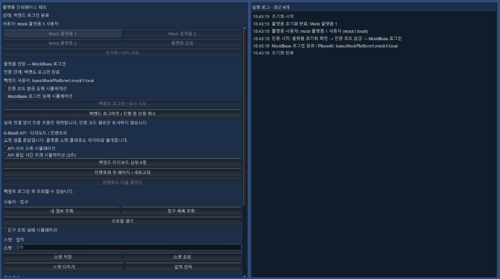

# Unity Client Portfolio

Unity 클라이언트 개발 실무에서 담당했던 **플랫폼 연동과 게임 백엔드 API 호출 흐름**을 재구성한 코드 샘플입니다.

플랫폼별 구현을 공통 인터페이스로 사용하는 구조, 플랫폼 인증 코드를 통한 백엔드 로그인, 비동기 요청의 취소와 오류 처리를 확인할 수 있습니다. 
단독으로 가볍게 동작하고 흐름만 확인할 수 있도록 플랫폼 SDK와 G-BaaS는 Mocking했습니다.

## 데모 화면


왼쪽 패널에서 기능과 실패 옵션을 선택하고, 오른쪽 실행 로그에서 처리 결과를 확인합니다. 
왼쪽 패널을 스크롤하면 추가적인 기능도 확인할 수 있습니다.

## 실행 방법

1. Repository를 클론하고 유니티로 실행합니다.
2. Resources/PortfolioDemoSetting에서 시작 플랫폼을 선택합니다.
3. Main씬을 열고 에디터를 실행합니다.

## 주요 기능

| 구분 | 구현 내용 |
| --- | --- |
| 플랫폼 공통화 | `PlatformBase`를 기반으로 Mock 플랫폼 1·2·3 및 오프라인 구현 선택 |
| 사용자·친구 | 로컬 사용자 조회, 친구 목록 조회, 프로필 열기 요청, 친구 조회 실패 재현 |
| 스탯·업적·클라우드 | 스탯 조회·변경, 업적 해제, 스탯을 저장 데이터로 업로드·복원·삭제 |
| 제한 검사 | 사용자 제작 콘텐츠, 유저 간 상호작용, 유료 멤버십, 로컬 커뮤니케이션 검사 요청을 큐에서 처리 |
| 백엔드 인증 | 플랫폼 초기화 -> 인증 코드 발급 -> MockBaas 로그인 -> 백엔드 사용자 정보 보관 |
| 리더보드 API | 통계 이름·시작 위치·조회 개수를 요청하고 순위 목록 수신 |
| 인벤토리 API | 페이지 단위 조회, 다음 페이지 토큰 전달, 응답 누적 표시 |
| 예외 상황 | 인증 실패·API 서버 오류·시간 초과 재현, 재시도, 로그아웃 시 진행 중 API 요청 취소 |

## 구조와 역할

플랫폼과 백엔드를 각각 구현하고, `PlatformDemo`와 `LoginFlow`에서 연결합니다.

```text
PlatformDemo — 실행 순서 및 화면 표시
  ├─ PlatformManager -> PlatformBase → MockPlatform / NoPlatform
  │                    └─ 사용자·친구 / 스탯 / 클라우드 / 제한 검사 / 인증 코드
  ├─ LoginFlow
  │    ├─ 초기화된 플랫폼에서 인증 코드 획득
  │    └─ IBaasAuth -> MockBaas 로그인
  └─ IBaasApi 계약을 구현한 MockBaas
       └─ 요청 객체 -> 공통 실행 처리 -> 리더보드 / 인벤토리 응답
```

## 코드 살펴보기

| 파일 | 살펴볼 내용 |
| --- | --- |
| [PlatformManager.cs](Assets/Scripts/PlatformPortfolio/Unity/PlatformManager.cs) | 플랫폼 구현체 선택, 초기화 공유, 종료 처리 |
| [PlatformBase.cs](Assets/Scripts/PlatformPortfolio/Core/PlatformBase.cs) / [PlatformSession.cs](Assets/Scripts/PlatformPortfolio/Core/PlatformSession.cs) | 공통 기능과 플랫폼 세션에 연결된 요청 취소 |
| [LoginFlow.cs](Assets/Scripts/Login/LoginFlow.cs) | 플랫폼 인증과 백엔드 로그인을 연결하는 상위 흐름 |
| [MockBaas.cs](Assets/Scripts/Baas/MockBaas.cs) | 플랫폼 인증 코드를 전달받는 Mock 로그인 |
| [MockBaas.Api.cs](Assets/Scripts/Baas/MockBaas.Api.cs) / [BaasApiModels.cs](Assets/Scripts/Baas/BaasApiModels.cs) | API 요청·응답 모델, 공통 실행 처리, 페이지 조회 |
| [PlatformTaskManager.cs](Assets/Scripts/PlatformPortfolio/Unity/PlatformTaskManager.cs) | 제한 검사 요청의 큐 처리 |
| [PlatformDemo.cs](Assets/Scripts/PlatformPortfolio/Unity/PlatformDemo.cs) | 데모 조작 UI, 기능 연결, 실행 로그 |

## 구현 범위

- 실무 경험을 설명하기 위해 재구성한 샘플이며, 실제 SDK를 호출하지 않습니다.
- 인증 코드는 데모용 문자열입니다.
- 리더보드와 인벤토리는 고정 샘플 데이터입니다.
- 플랫폼 제한 정책과 프로필·안내창 요청은 시뮬레이션입니다.

